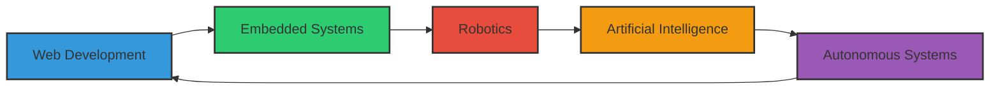

# Mohamed Yousif
<div align="center">
  
  
  
  [](https://git.io/typing-svg)

</div>

## 👨‍💻 About Me

```javascript
const mohamed = {
  title: "Full-Stack Developer & Robotics Engineer",
  location: "Tech Universe, Earth",
  currentFocus: "Caretta Robotics",
  code: ["JavaScript", "TypeScript", "Python", "C++", "Java"],
  technologies: {
    frontEnd: {
      js: ["React", "Next.js", "Vue"],
      css: ["Tailwind", "SCSS", "Styled Components"]
    },
    backEnd: {
      js: ["Node", "Express"],
      python: ["Django", "Flask"],
      misc: ["GraphQL", "REST APIs"]
    },
    databases: ["MongoDB", "PostgreSQL", "Firebase"],
    ai: ["TensorFlow", "PyTorch", "Computer Vision"],
    robotics: ["ROS", "Sensor Fusion", "Control Systems"],
    devOps: ["AWS", "Docker", "CI/CD", "GitHub Actions"]
  },
  currentLearning: ["Reinforcement Learning", "Generative AI", "Edge Computing"],
  challenge: "Creating robots that can learn and adapt like humans"
};
```

## 🛠️ Tech Stack Visualization

<div align="center">
  
  
  
  
  
  
  
  
  
  
</div>

## 🚀 Project Cosmos

<div align="center">
  <table>
    <tr>
      <td width="50%">
        <h3 align="center">Robotic Intelligence</h3>
        <div align="center">
          <a href="#" target="_blank">
            
          </a>
          <p>
            <a href="#" target="_blank">
              
            </a>
            <a href="#" target="_blank">
              
            </a>
          </p>
          <p><strong>Python, TensorFlow, ROS</strong> - Autonomous robotic systems that learn from their environment</p>
        </div>
      </td>
      <td width="50%">
        <h3 align="center">AI Vision Systems</h3>
        <div align="center">
          <a href="#" target="_blank">
            
          </a>
          <p>
            <a href="#" target="_blank">
              
            </a>
            <a href="#" target="_blank">
              
            </a>
          </p>
          <p><strong>Python, OpenCV, PyTorch</strong> - Advanced computer vision for object detection and scene understanding</p>
        </div>
      </td>
    </tr>
    <tr>
      <td width="50%">
        <h3 align="center">Smart Web Platform</h3>
        <div align="center">
          <a href="#" target="_blank">
            
          </a>
          <p>
            <a href="#" target="_blank">
              
            </a>
            <a href="#" target="_blank">
              
            </a>
          </p>
          <p><strong>Next.js, TypeScript, Tailwind</strong> - Full-stack application with AI-driven features</p>
        </div>
      </td>
      <td width="50%">
        <h3 align="center">IoT Ecosystem</h3>
        <div align="center">
          <a href="#" target="_blank">
            
          </a>
          <p>
            <a href="#" target="_blank">
              
            </a>
            <a href="#" target="_blank">
              
            </a>
          </p>
          <p><strong>C++, Node.js, MQTT</strong> - Connected embedded systems with cloud integration</p>
        </div>
      </td>
    </tr>
  </table>
</div>

## 📈 GitHub Analytics

<div align="center">
  
  
</div>

## 🔄 My Development Journey



## 🌐 Connect With Me

<div align="center">
  
  [](https://linkedin.com/in/mohamedyousif)
  [](https://github.com/mohamedyousif)
  [](https://twitter.com/mohamedyousif)
  [](mailto:contact@mohamedyousif.com)
  
</div>

<div align="center">

  
  
  
  
</div>
